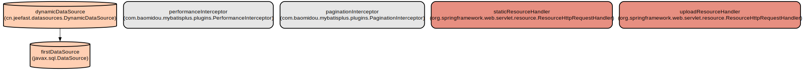
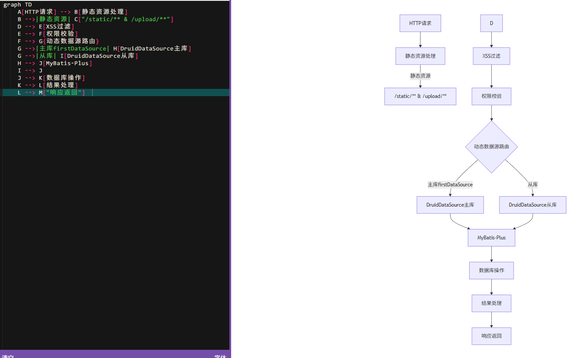
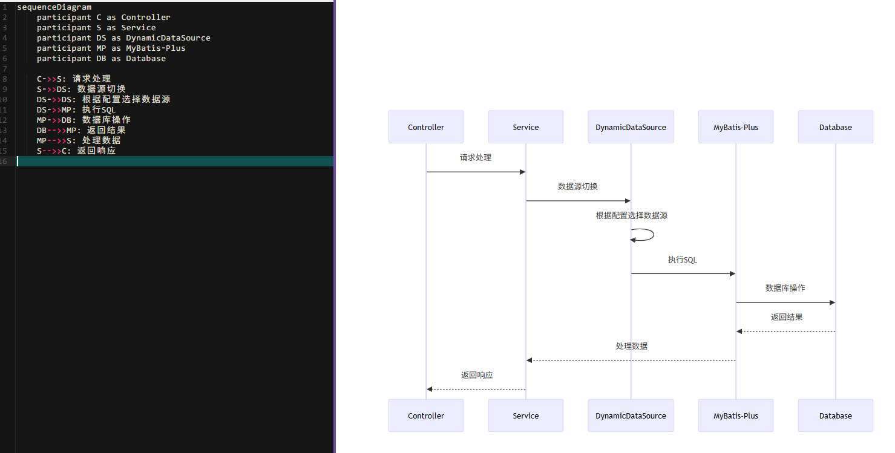
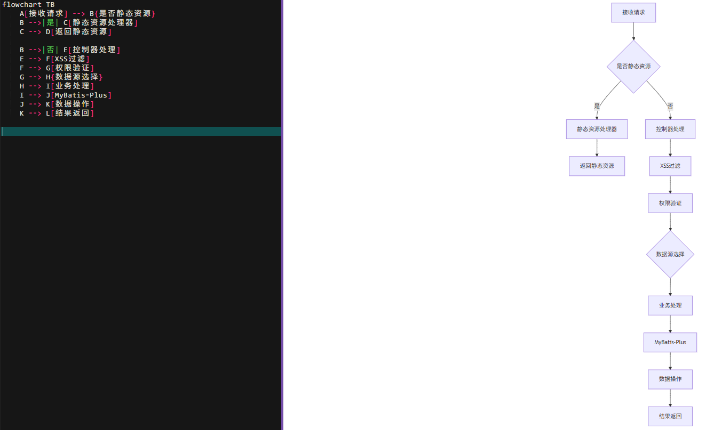
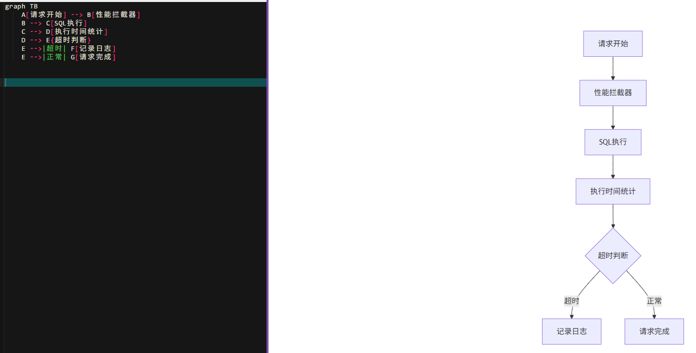
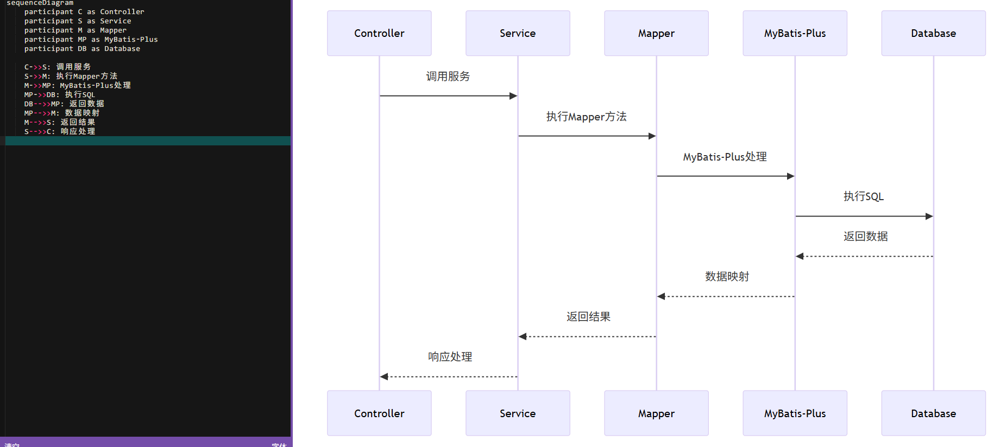
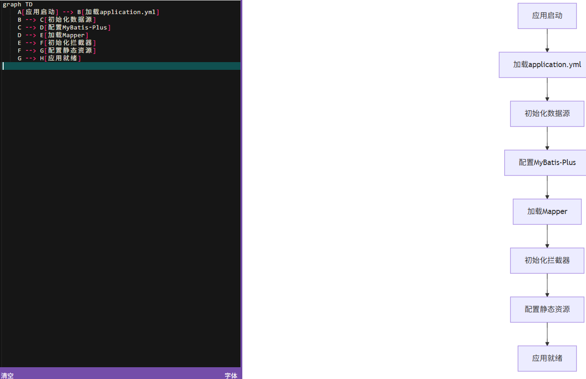
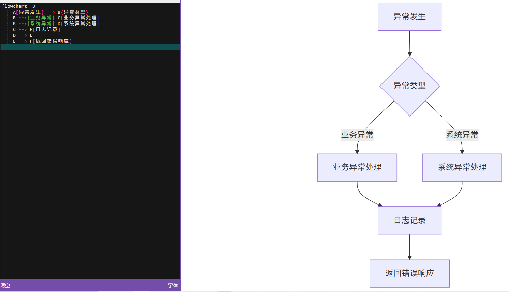

# JeeFast: A Modern Enterprise Web Application Framework with Dynamic Data Source Support

JeeFast is a robust enterprise web application framework built on Spring Boot that provides dynamic data source switching, comprehensive security features, and a rich set of UI components. It enables rapid development of secure, scalable enterprise applications with support for multiple databases.

The framework combines Spring Boot, MyBatis-Plus, Shiro security framework, and modern frontend technologies to deliver a complete solution for building enterprise web applications. It features a modular architecture, role-based access control, cross-site scripting (XSS) protection, and dynamic UI components powered by Vue.js and jQuery plugins.
## JeeFast：一个支持动态数据源的现代企业Web应用程序框架 
JeeFast 是一个基于Spring Boot的健壮的企业web应用程序框架，它提供了动
态数据源切换、全面的安全特性和丰富的UI组件集。它支持快速开发支持多
个数据库的安全、可扩展的企业应用程序。 该框架结合 了Spring Boot、
MyBatis-Plus、Shiro安全框架和现代前端技术，为构建企业web应用程
序提供了一个完整的解决方案。它具有模块化架构，基于角色的访问控制，
跨站点脚本（XSS）保护，以及由Vue.js和jQuery插件支持的动态UI组件。

## Repository Structure
```
.
├── src/main/java/cn/jeefast/
│   ├── common/                 # Common utilities and base components
│   │   ├── annotation/         # Custom annotations for AOP functionality
│   │   ├── aspect/            # AOP aspects for logging, data filtering, etc.
│   │   ├── exception/         # Exception handling
│   │   ├── utils/             # Utility classes
│   │   ├── validator/         # Validation components
│   │   └── xss/              # XSS protection filters
│   ├── config/                # Application configuration classes
│   ├── datasources/           # Dynamic data source implementation
│   └── system/                # Core system modules
│       ├── controller/        # MVC controllers
│       ├── dao/              # Data access objects
│       ├── entity/           # Domain entities
│       ├── service/          # Business services
│       └── util/             # System utilities
└── src/main/resources/
    ├── mapper/               # MyBatis mapper XML files
    ├── static/              # Static web resources
    └── views/               # View templates
```

## Usage Instructions

### Prerequisites
- JDK 8 or higher
- Maven 3.6+
- MySQL 5.7+
- Redis for caching support
- Node.js and npm for frontend development

### Installation

1. Clone the repository:
```bash
git clone https://github.com/yourusername/jeefast.git
cd jeefast
```

2. Configure database connection in application.yml:
```yaml
spring:
  datasource:
    druid:
      first:
        url: jdbc:mysql://localhost:3306/mydb?useUnicode=true&characterEncoding=UTF-8
        username: root
        password: 123456
```

3. Build the project:
```bash
mvn clean package
```

4. Run the application:
```bash
java -jar target/jeefast.jar
```

### Quick Start

1. Access the application at http://localhost:9090

2. Login with default credentials:
- Username: admin
- Password: admin

3. Navigate through the menu to explore different modules

### More Detailed Examples

1. Implementing dynamic data source switching:
```java
@DataSource(name = DataSourceNames.FIRST)
public void methodUsingFirstDataSource() {
    // Method implementation
}
```

2. Adding XSS protection to endpoints:
```java
@RestController
public class MyController {
    @RequestMapping("/endpoint")
    public String endpoint(@RequestParam String input) {
        // Input is automatically filtered for XSS
        return service.process(input);
    }
}
```

### Troubleshooting

1. Database Connection Issues
- Verify database credentials in application.yml
- Ensure MySQL service is running
- Check network connectivity
- Enable debug logging:
```yaml
logging:
  level:
    cn.jeefast: DEBUG
```

2. Redis Connection Issues
- Verify Redis is running: `redis-cli ping`
- Check Redis configuration in application.yml
- Review logs in /logs/jeefast.log

## Data Flow
The application follows a layered architecture with clear separation of concerns.

```ascii
[Client Browser] 
      ↓ HTTP
[Controller Layer]
      ↓ 
[Service Layer] → [Dynamic DataSource Router]
      ↓                    ↓
[DAO Layer]    →    [Multiple Databases]
```

Key component interactions:
- Controllers handle HTTP requests and manage view rendering
- Services implement business logic and transaction management
- Dynamic DataSource router switches between configured databases
- DAO layer handles data persistence using MyBatis-Plus
- Security aspects enforce access control across all layers

控制器处理HTTP请求和管理视图渲染
服务实现业务逻辑和事务管理
动态数据源路由器在配置的数据库之间进行切换
DAO层使用MyBatis-Plus处理数据持久性
安全方面强制跨所有层的访问控制

## Infrastructure



### Database Configuration
- Primary DataSource (firstDataSource):
  - Type: DruidDataSource
  - Purpose: Main application database
  - Configuration: Defined in application.yml

### Web Configuration
- Static Resource Handlers:
  - /static/** → classpath:/static/
  - /upload/** → file:E:/upload/

### MyBatis-Plus Configuration
- Mapper Scan Packages:
  - cn.jeefast.modules.*.dao
  - cn.jeefast.system.dao
- Features:
  - Performance monitoring interceptor
  - Pagination support
  - Local page helper enabled
## 1. 系统整体流程

## 2.数据源切换流程
- 
## 3.请求处理流程

## 4. 性能监控流程

## 5. 数据访问流程

## 6. 配置加载流程

## 7. 异常处理流程
